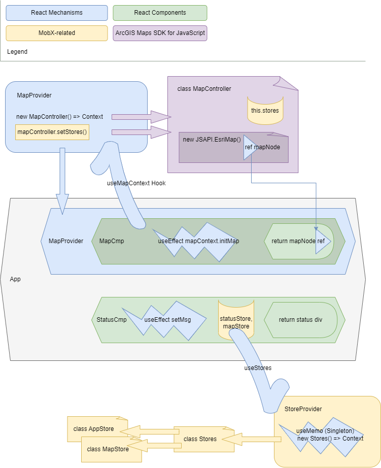

#### <i>Esri Services Enablement Workshop 2023​</i>
### Sam Matenaer · Niklas Köhn
# React and the ​ArcGIS Maps SDK for JavaScript​

## Task Group 1

Update the code so the ``StatusCmp`` displays the center point of the map and updates as it changes when moving the map.

### Hints
* ``MapController`` is the class initializing Map and MapView. Use JSSDK methods here to get the data and bring it into stage mgmt.
* ``MapProvider`` and ``useMapContext`` are the context provider and hook to provide other parts of your application programmatic access to your map. You don't need to touch these for this task.
* ``MapStore`` is the state mgmt class for your map. It's being initialized in the central ``Stores.ts``, which can be consumed in any component by using the ``useStores`` hook.

---
---
---

# Minimalistic ArcGIS JSAPI Map with React

There is a basic difference between the class-based Esri Map and the component-based UI framework React.

| Esri Map Class                                                            | React Component                                                        |                                                                                                                                                                                                                                                                                                                                                                                                                                    |
| ------------------------------------------------------------------------- | ---------------------------------------------------------------------- | ---------------------------------------------------------------------------------------------------------------------------------------------------------------------------------------------------------------------------------------------------------------------------------------------------------------------------------------------------------------------------------------------------------------------------------- |
|  |  | <small>Dog photo by <a href="https://unsplash.com/@brookecagle?utm_source=unsplash&utm_medium=referral&utm_content=creditCopyText">Brooke Cagle</a>,  cat photo by <a href="https://unsplash.com/@magict1911?utm_source=unsplash&utm_medium=referral&utm_content=creditCopyText">Timo Volz</a>  on <a href="https://unsplash.com/?utm_source=unsplash&utm_medium=referral&utm_content=creditCopyText">Unsplash</a></small> |
| <b>OMG you initialized me!  Can I render now, master?</b>             | <b>I'll render whenever it suits me, human.</b>                        |                                                                                                                                                                                                                                                                                                                                                                                                                                    |

---

The point of this repo is to show our pattern of de-coupling the imperative Esri Map object from the rest of the component-based application. 
* We're using MobX stores for state management throughout the application and React hooks and providers to bring them into the components.
* The class-based Map gets a Controller for initialization and interoperability functions. The controller is as well distributed via React hook and provider.

---

# Architecture Overview

---

This project was bootstrapped with [Create React App](https://github.com/facebook/create-react-app).

## Available Scripts

In the project directory, you can run:

### `npm start`

Runs the app in the development mode.\
Open [http://localhost:3000](http://localhost:3000) to view it in the browser.

The page will reload if you make edits.\
You will also see any lint errors in the console.

### `npm test`

Launches the test runner in the interactive watch mode.\
See the section about [running tests](https://facebook.github.io/create-react-app/docs/running-tests) for more information.

### `npm run build`

Builds the app for production to the `build` folder.\
It correctly bundles React in production mode and optimizes the build for the best performance.

The build is minified and the filenames include the hashes.\
Your app is ready to be deployed!

See the section about [deployment](https://facebook.github.io/create-react-app/docs/deployment) for more information.

### `npm run eject`

**Note: this is a one-way operation. Once you `eject`, you can’t go back!**

If you aren’t satisfied with the build tool and configuration choices, you can `eject` at any time. This command will remove the single build dependency from your project.

Instead, it will copy all the configuration files and the transitive dependencies (webpack, Babel, ESLint, etc) right into your project so you have full control over them. All of the commands except `eject` will still work, but they will point to the copied scripts so you can tweak them. At this point you’re on your own.

You don’t have to ever use `eject`. The curated feature set is suitable for small and middle deployments, and you shouldn’t feel obligated to use this feature. However we understand that this tool wouldn’t be useful if you couldn’t customize it when you are ready for it.

## Learn More

You can learn more in the [Create React App documentation](https://facebook.github.io/create-react-app/docs/getting-started).

To learn React, check out the [React documentation](https://reactjs.org/).
